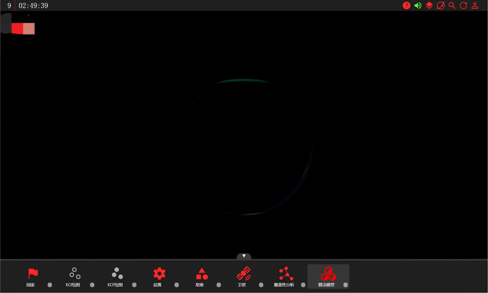
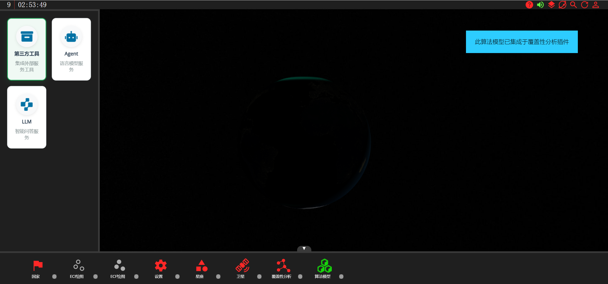
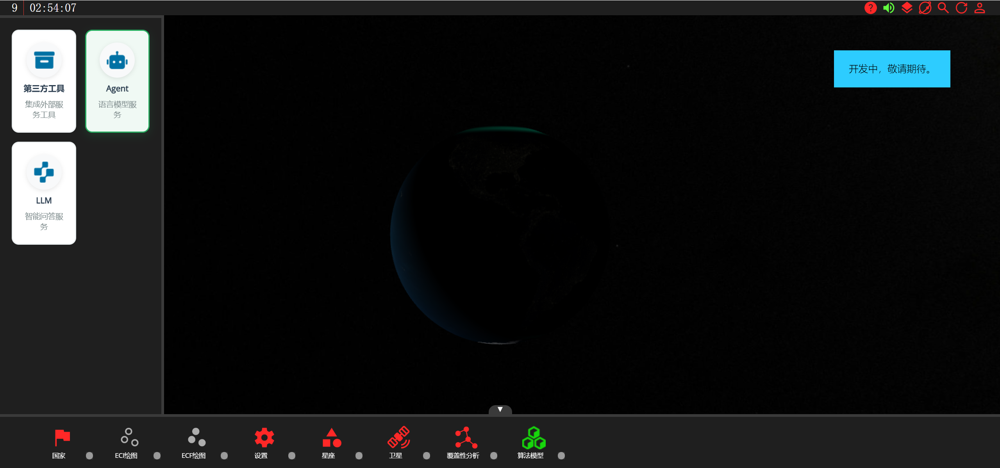
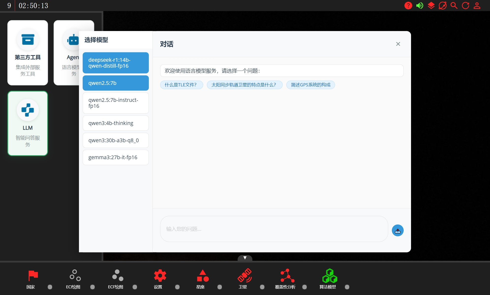
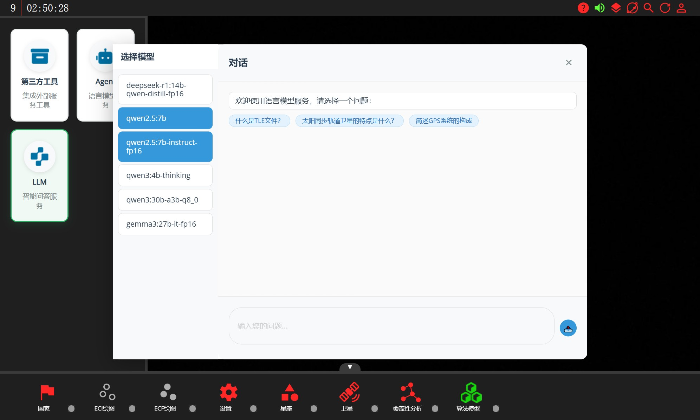
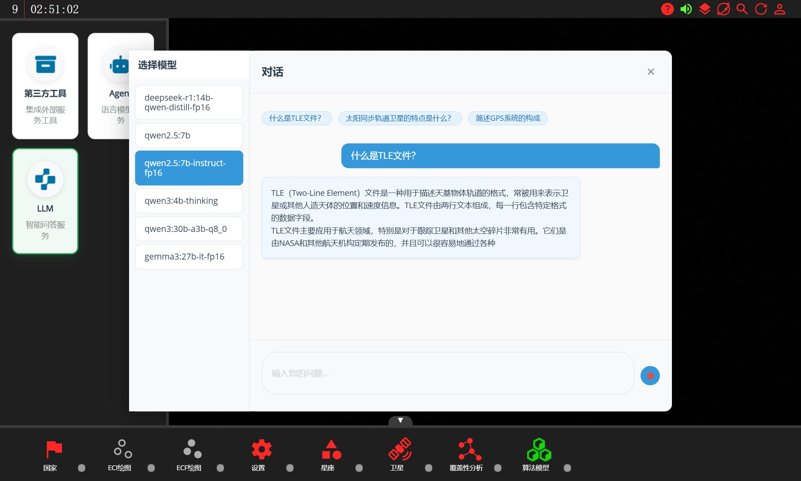
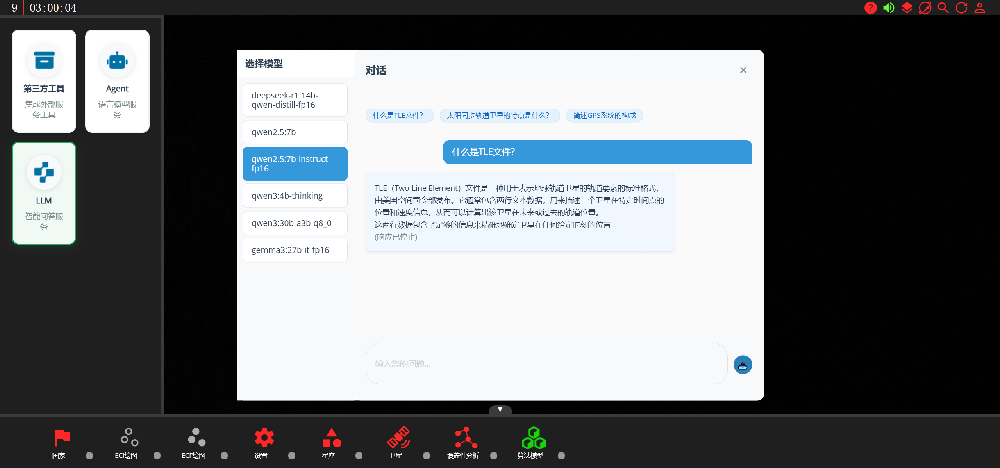

# "算法模型"模块

"算法模型"模块主要集成一些算法模型和实用的AI工具。

打开"算法模型"的设置页面，点击"第三方工具"，屏幕会出现回显"此算法模型已集成于覆盖性分析模块"，这是因为"覆盖性分析"模块中已集成了STK的仿真功能，可以直接在"覆盖性分析"模块中使用。

点击"Agent"，屏幕会出现回显"开发中，敬请期待"，这是因为智能体功能目前还在迭代开发中，预计在下一个版本更新中会加入。

"LLM"模块提供了一个界面和本地部署的LLM进行交互，目前暂时仅支持Ollama框架。

页面会自动从后端API获取当前Ollama框架中部署的所有模型，并显示在左侧的模型选择列表中。

用户可以任意选择列表中的模型进行对话交互，有一些预设的气泡问题，可以直接点击使用。

如果想提前中止模型的对话生成，还可以点击文本输入框右侧的停止按钮。

