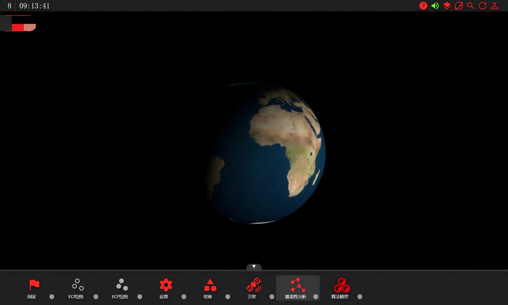
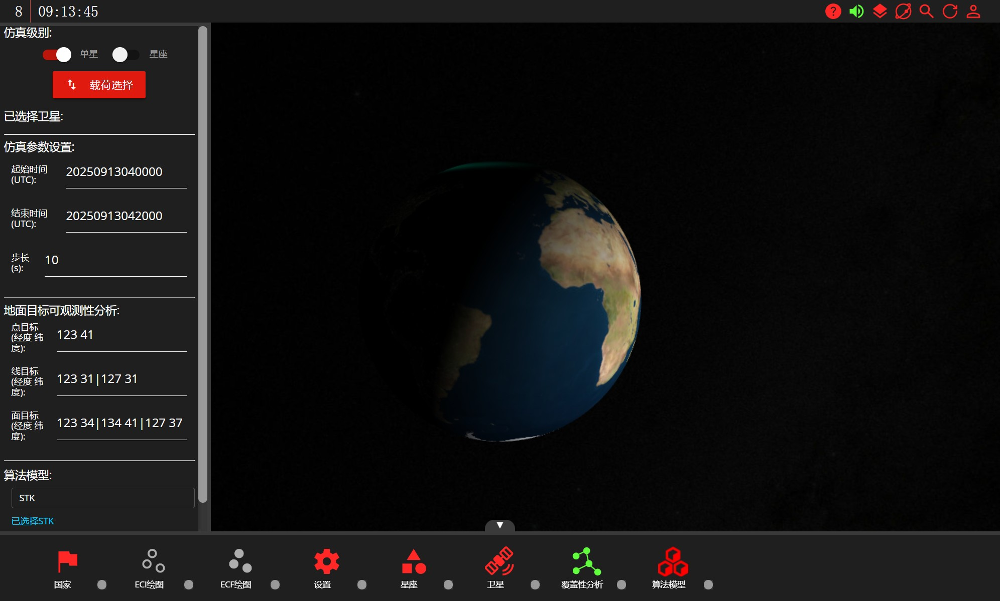
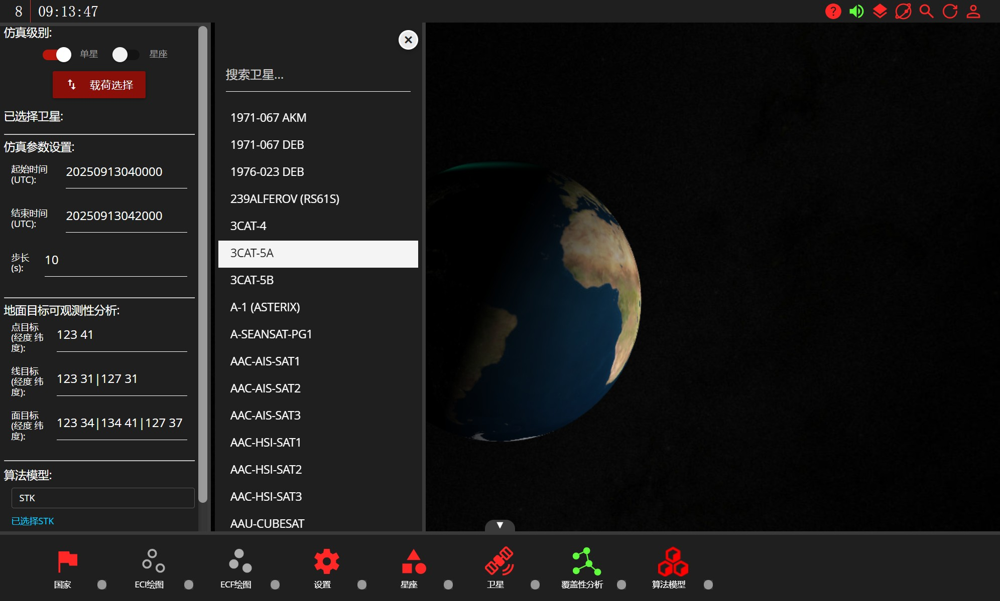
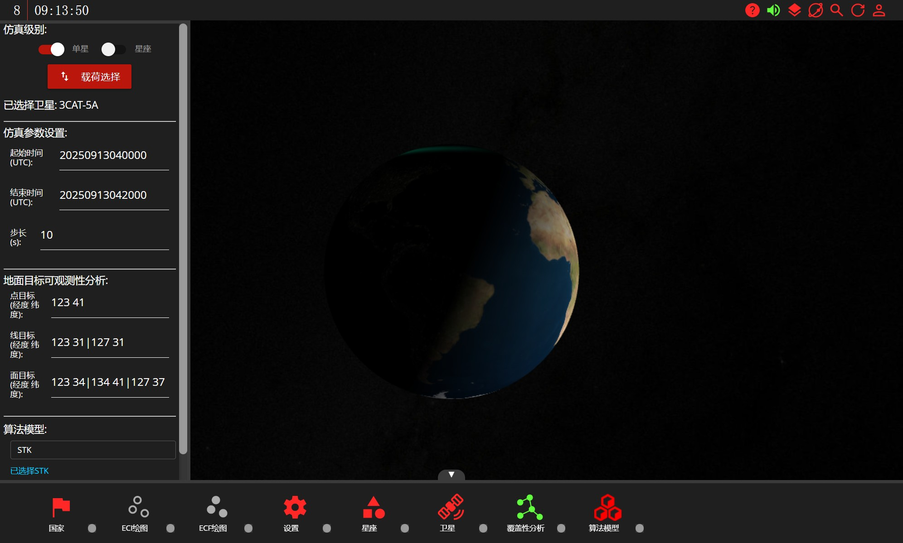
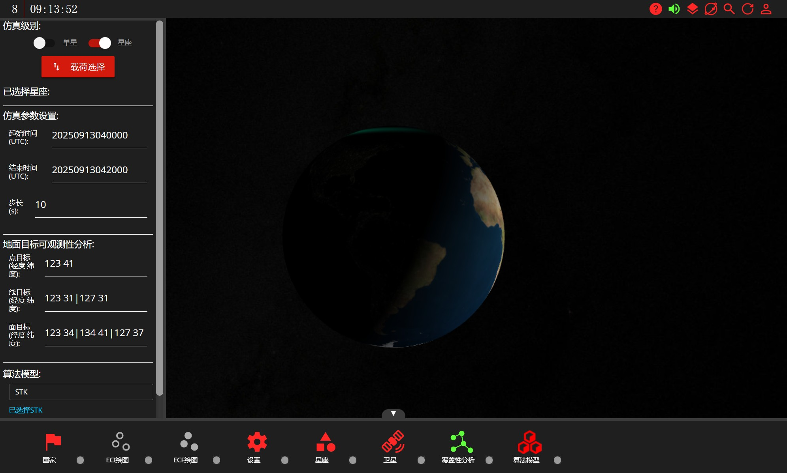
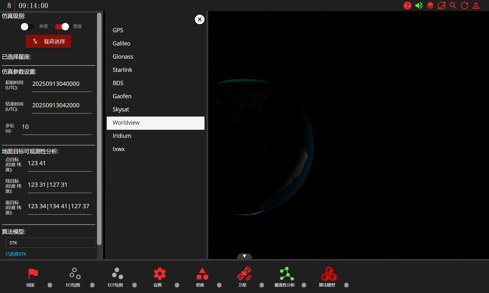
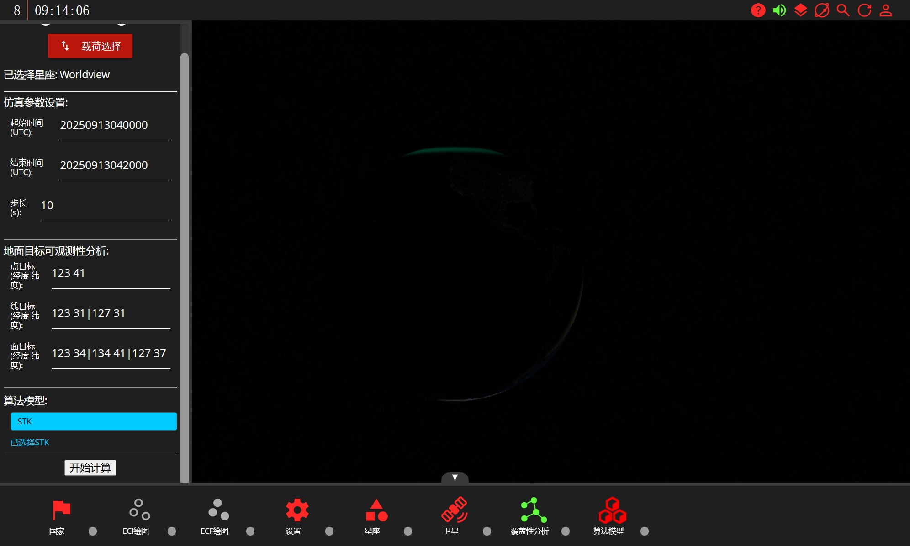
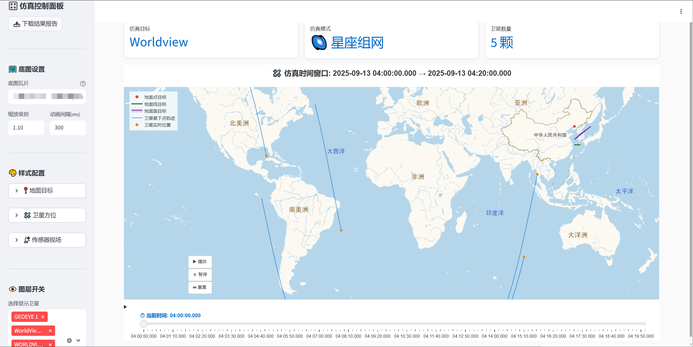

# "覆盖性分析"模块

"覆盖性分析"模块主要针对单星/星座进行某一时段内的覆盖性分析，当前的功能暂时只支持搭载光学传感器的单星和对地观测星座。

点击打开"覆盖性分析"模块之后，在左侧会出现用于仿真计算的参数设置界面。仿真级别可以选择"单星"或者"星座"，这取决于具体的任务需求。仿真参数设置中有3个参数需要手动设置："起始时间"、"结束时间"和"步长"。其中起始时间和结束时间以‘YYYYMMDDHHMMSS’的格式输入UTC时间，表明仿真任务预测的时间段范围。步长默认为10s，表示仿真时预测卫星轨道投影的时间间隔。地面目标可观测性分析用于设置需要进行覆盖性分析的地面目标，支持点、线、面3种类型，按照输入的经纬度来定义目标位置。点目标的设置较简单，在经度和纬度之间以一个空格" "隔开即可；线目标和面目标涉及到多个点位，单点的坐标设置不变，不同的点坐标之间通过"|"隔开。覆盖性分析的算法将默认调用STK的API实现。

进行仿真计算前需要优先选择仿真的级别，比如我们先选择"单星"，然后点击"载荷设置"。

在出现的数据表中，我们点击选择一颗想要进行仿真计算的卫星。由于当前算法仅支持搭载光学传感器的卫星，因此在进行计算前请先确保相关的传感器参数设置完成，详情可参考"卫星"模块的使用说明。

我们也可以选择"星座"级别进行仿真计算。

在"载荷设置"页面中，我们需要选择一个对地观测星座。同样的我们需要先确保星座中每个卫星传感器的参数都已经设置完成。。

选中我们想要进行仿真的单星/星座之后，我们继续按照任务需求设置相关的仿真参数，完成后点击"开始计算"。

仿真当前运行的状态会实时同步到仿真栏目的右侧的信息框中，便于监测当前的算法运行阶段。

仿真计算完成后，会出现一个可视化页面来呈现最终的仿真结果。

可视化页面的左侧会列出所有用于仿真的卫星目标和配置信息。每个卫星在设置的时间段内运行的轨迹投影和视场范围投影都会动态显示在页面上，同时设置的点、线和面目标也会在页面上展示。点击“播放”可以开始播放仿真动画，展示动态的仿真结果。