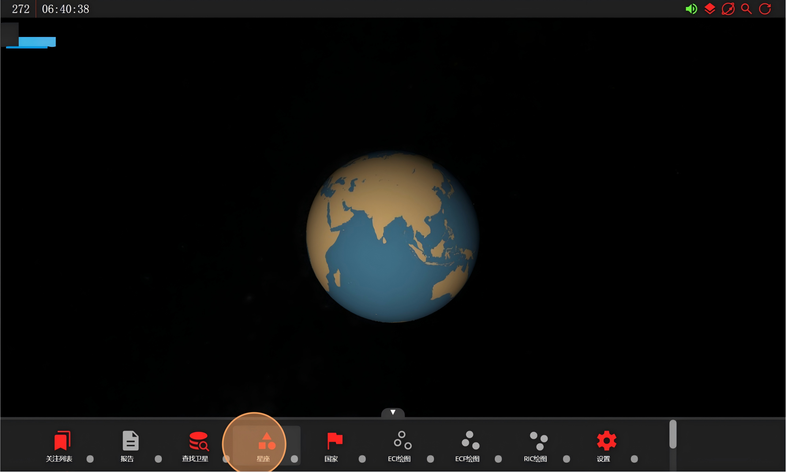
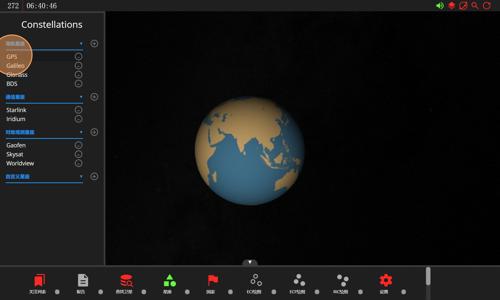
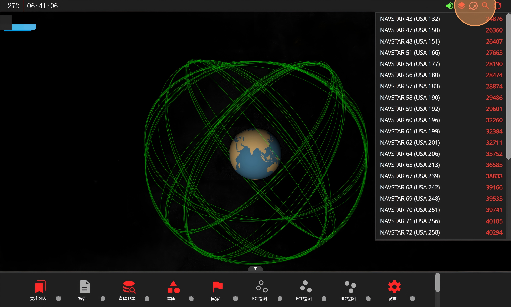
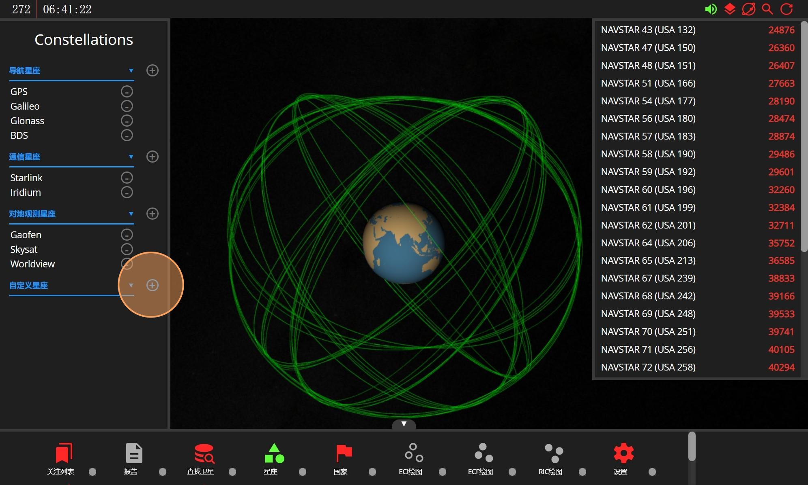
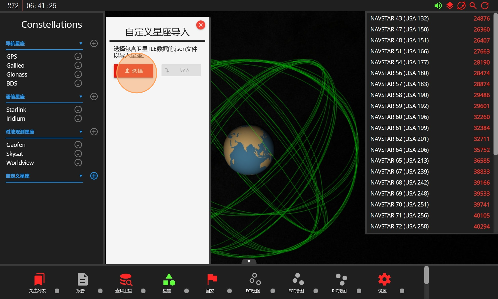
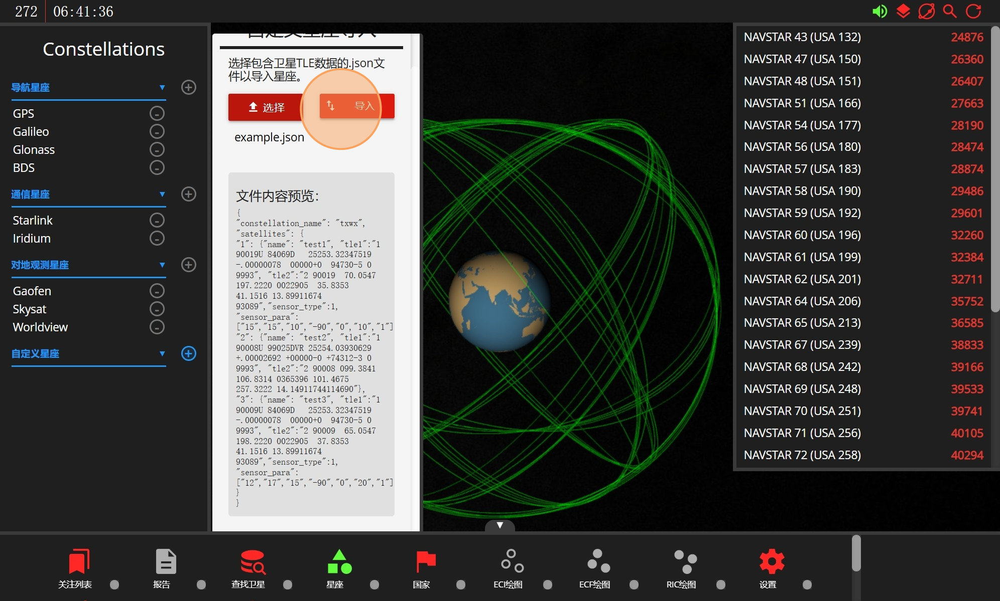
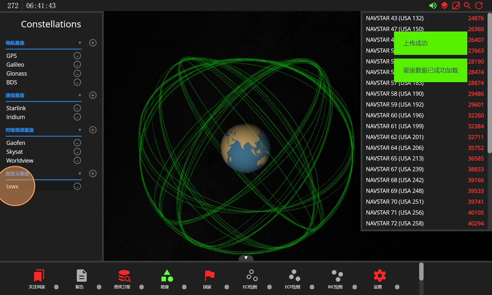
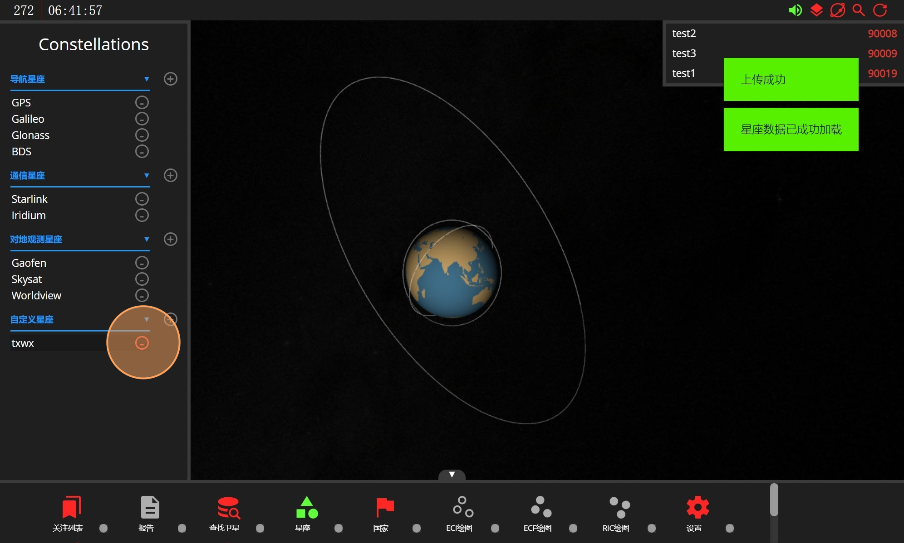
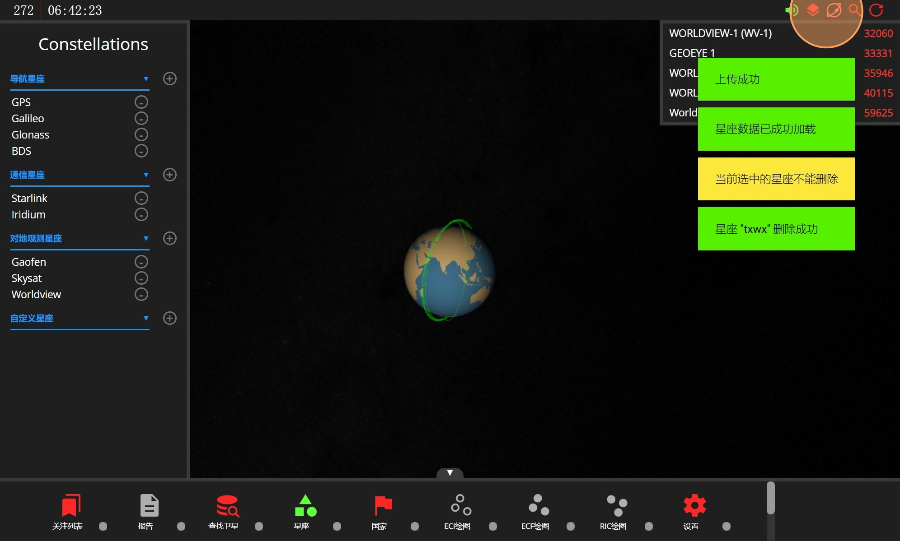

# "星座"模块

"星座"模块主要提供针对星座的导入和删除功能。点击"星座"后，所有的星座信息会以滚动列表的形式显示在左侧。

当前按照功能类型将星座划分为4类：导航星座、通信星座、对地观测星座和自定义星座。任意点击一个星座，其包含的所有卫星会以滚动列表的形式出现在右侧。

点击类别名称后面的加号可以自行导入星座，当前支持.json文件。

选择要导入的包含了星座信息的json文件，然后点击"导入"(导入的json文件的格式要求可查阅补充说明《导入文件格式要求》)。

"导入"完成后，屏幕上会出现回显信息"上传成功"。

如果要删除某个星座，则可以点击星座名称后面的减号。

在弹出的确认页面上选择确认删除，然后屏幕会弹出回显信息"星座xxxx删除成功"。

