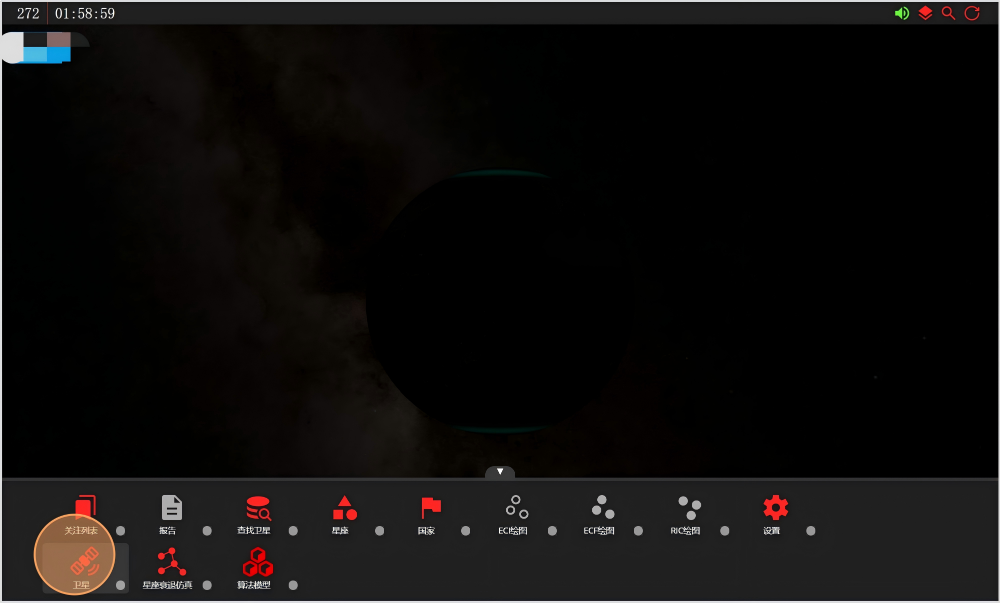
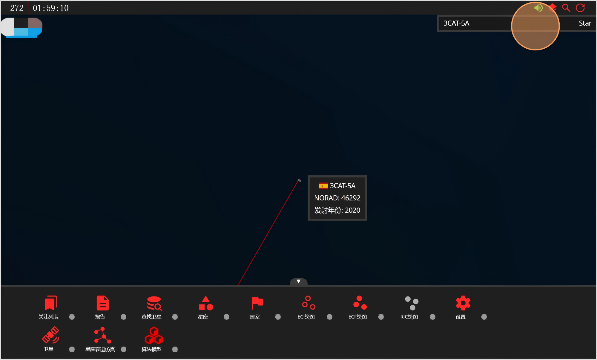
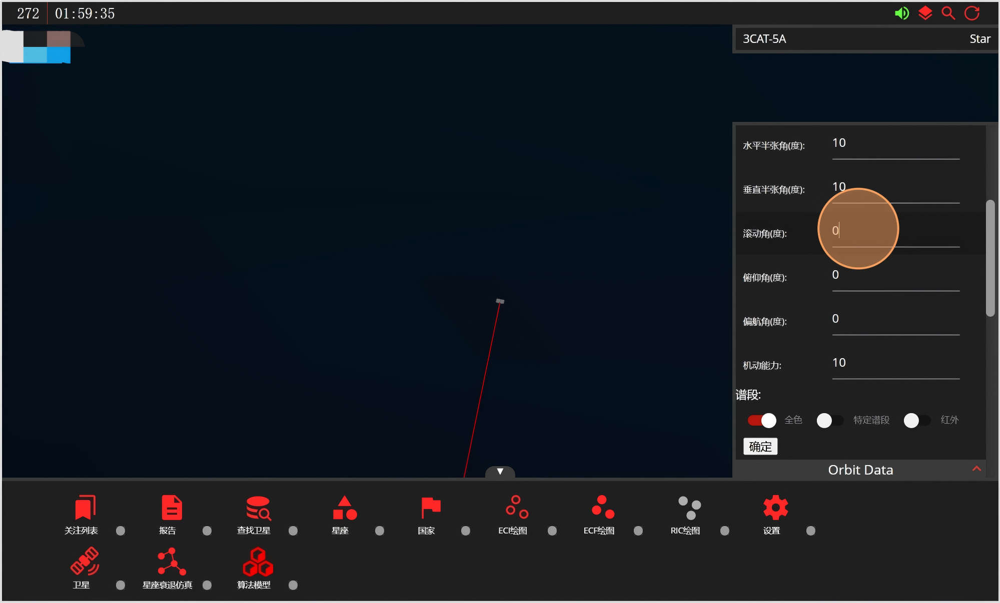
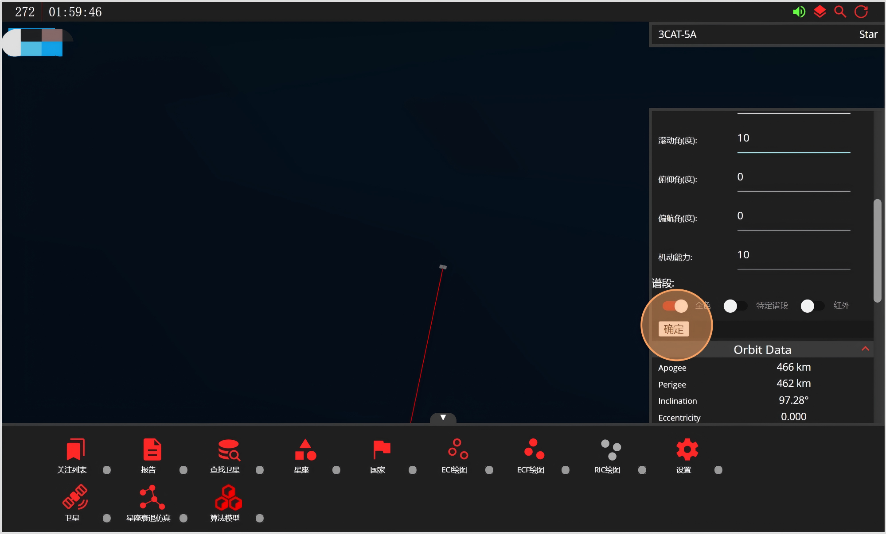
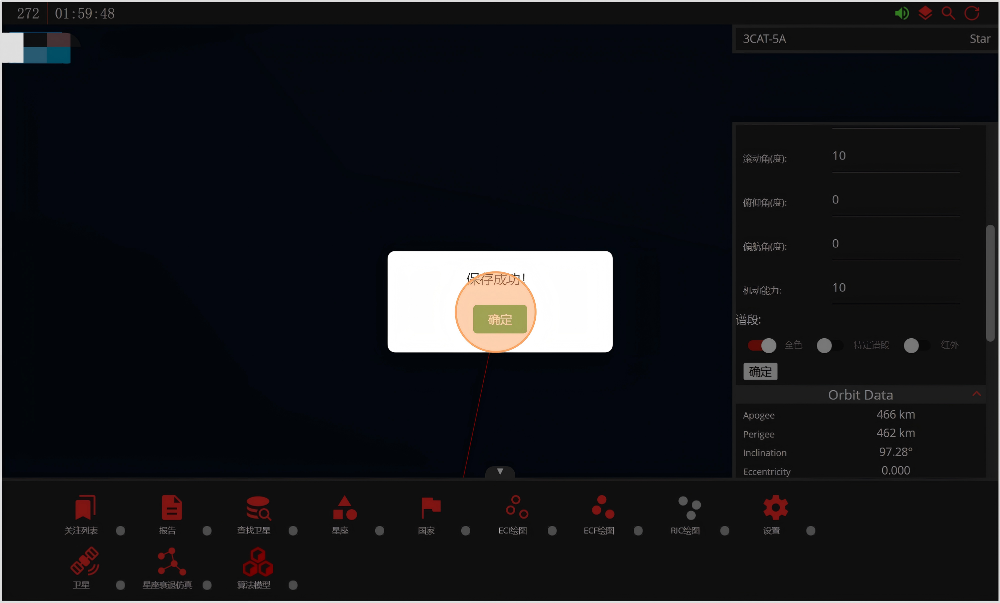
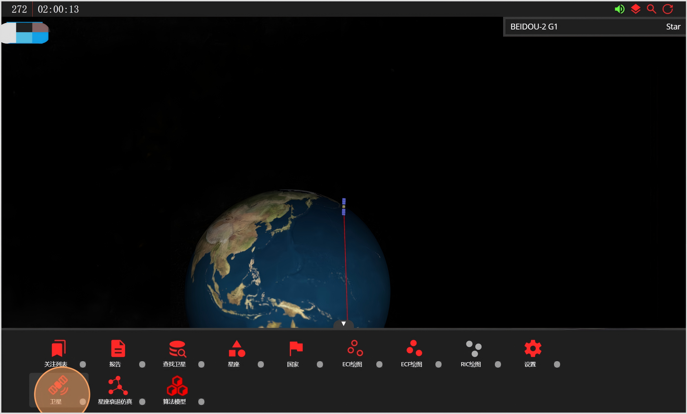
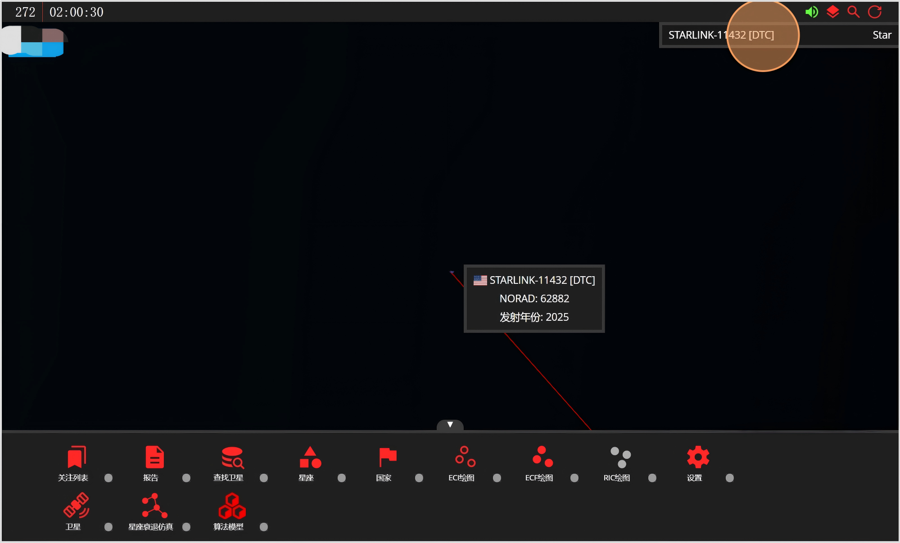

# 卫星模块
点击打开“卫星”模块。

左侧会以滚动列表的形式展示当前数据库中的所有卫星，任意点击一颗可查看相关参数。

在列表中点击一颗卫星后，视角会进行跳转，继续点击右上角的卫星信息栏可查看详细的轨道信息和传感器数据。

卫星信息栏中传感器参数可自由配置(当前只支持光学和SAR两类传感器)。

传感器参数设置完成后，点击确定。

出现回显“保存成功”，表明数据已同步到数据库。

“卫星”模块还支持按照名称或Norad ID检索卫星。

例如，输入“beidou”，可检索所有名称包含”beidou“的卫星，且不区分大小写。

输入“11432”，可检索Norad ID为“11432”的卫星。

