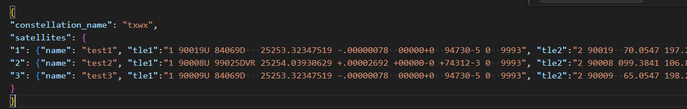
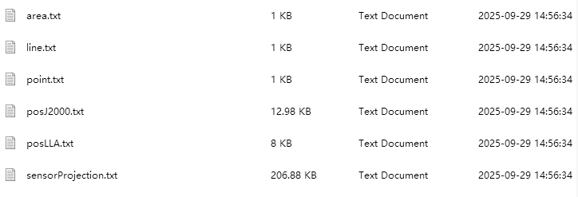
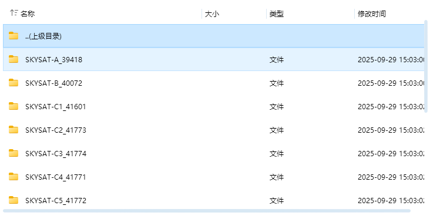
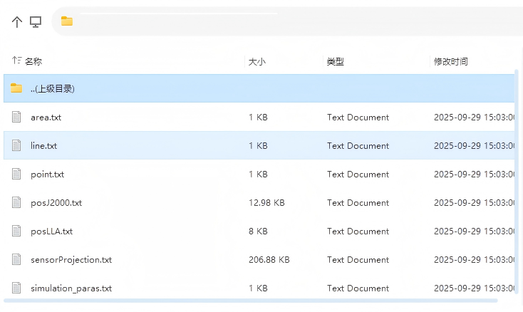
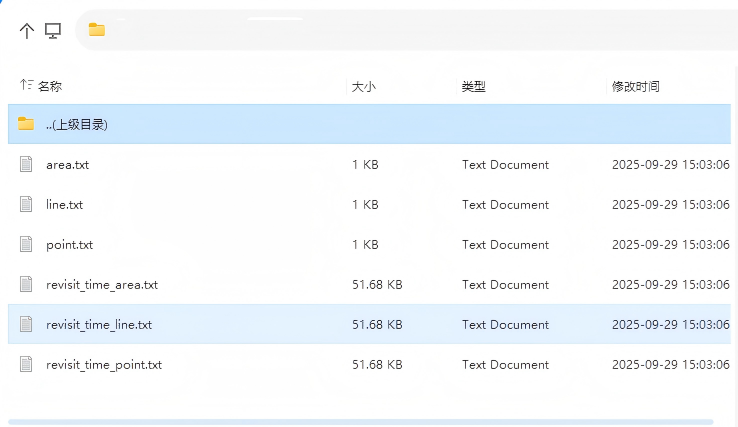

# 导入文件格式要求

1）导入星座的json文件格式示例如下：

星座包含的每个卫星数据中，"name"、"tle1"和"tle2"字段是必填的，其余的传感器参数设置等额外字段可自行添加。可额外添加的字段包括：{"sensor_type","sensor_para","Mass", "adcs", "altName", "bus", "configuration", "country", "diameter", "dryMass", "equipment", "launchDate", "launchMass", "launchPad","launchSite", "launchVehicle", "length", "manufacturer", "mission","motor", "name", "owner", "payload", "purpose", "rcs", "shape", "sources", "span", "stableDate", "status", "tle1", "tle2", "transmitterFrequencies", "type", "vmag"},
其中"sensor_type"和"type"字段的值为整数，"vmag"字段的值为浮点数，"sensor_para"字段的值为字符串元素类型的数组。

2）下载的仿真报告文件格式如下：

下载的单星仿真报告包含simulation_report文件夹，其中里面包含单星对设置的点、线和面目标的覆盖性时段表(point.txt, line.txt, area.txt)、单星运行的速度信息(posJ2000.txt)、单星运行的经纬度轨迹投影(posLLA.txt)和视场范围的经纬度投影(sensorProjection.txt)。

下载的星座仿真报告包含simulation_report和satellites_data两个文件夹。 satellites_data文件夹中包含该星座每个卫星的仿真报告(和单星级别相同)。

simulation_report文件夹下包含星座级别对设置的点、线和面目标的覆盖性时段表(point.txt, line.txt, area.txt)，以及三种目标各自在星座级别下的重返周期(revisit_time_area.txt, revisit_time_line.txt, revisit_time_point.txt)。

